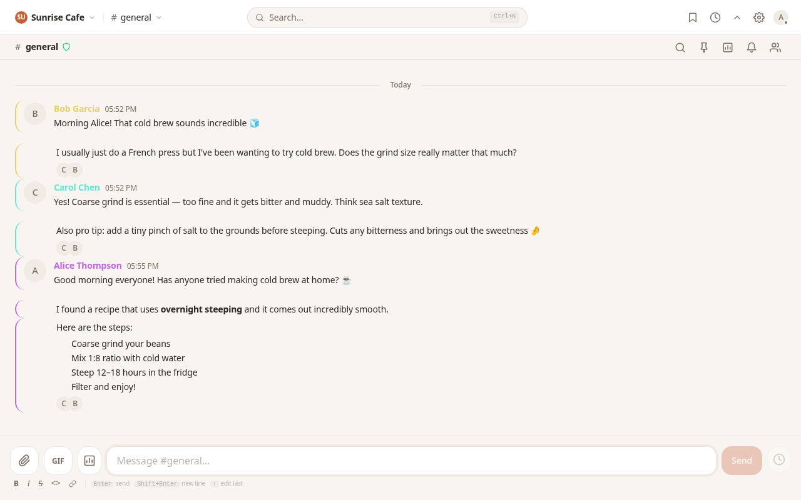
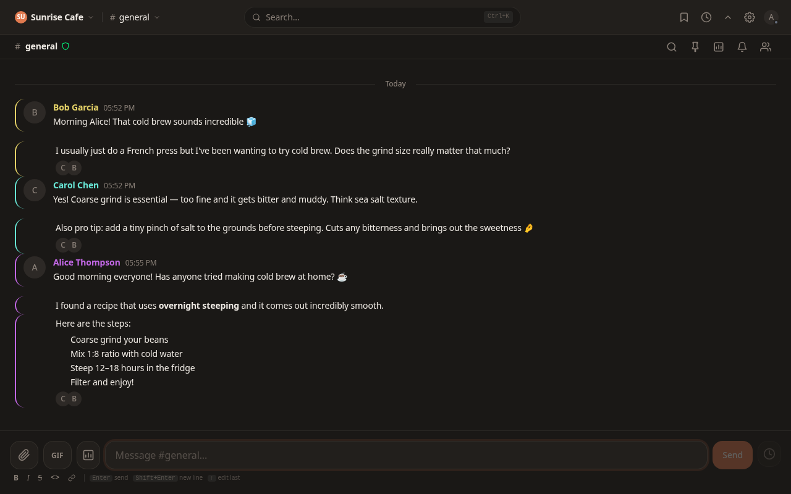
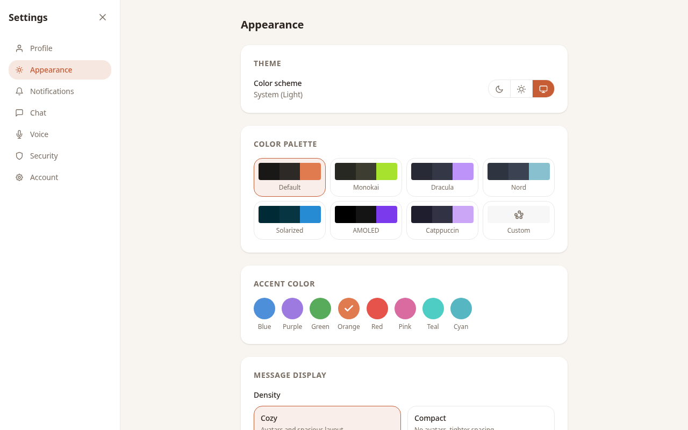
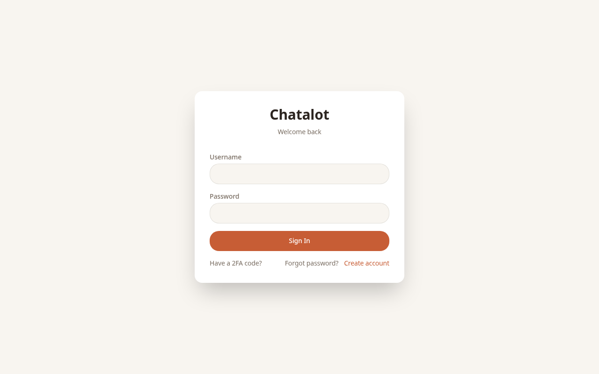
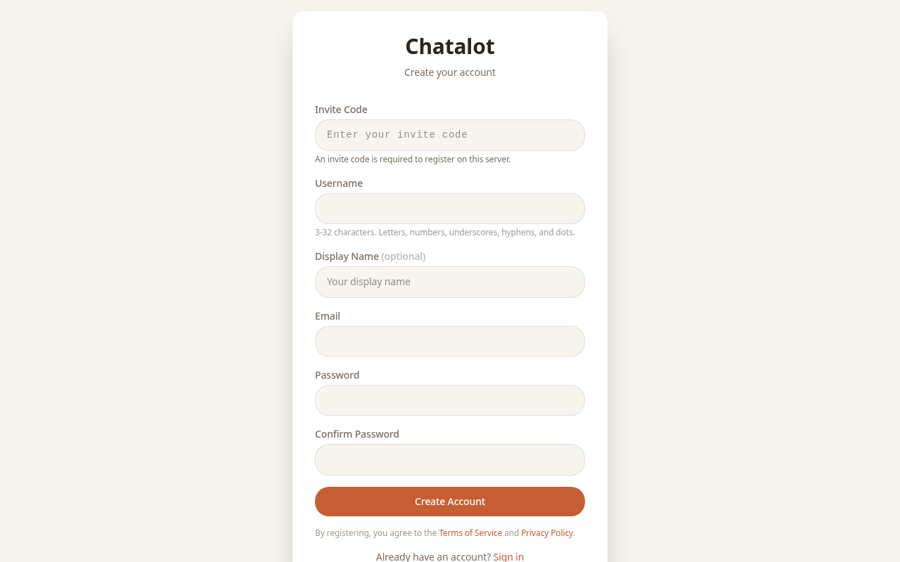
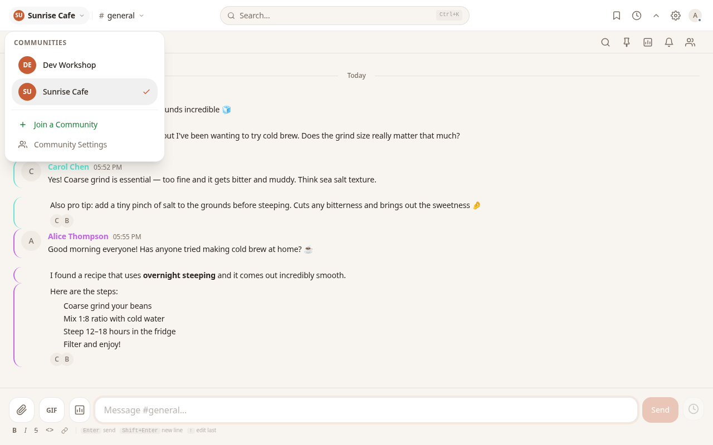
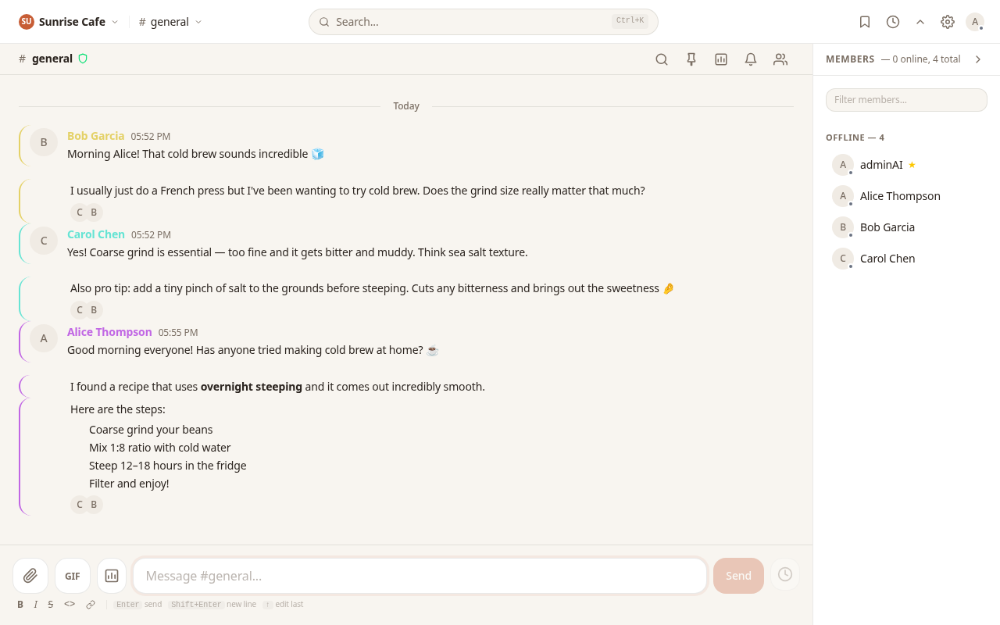
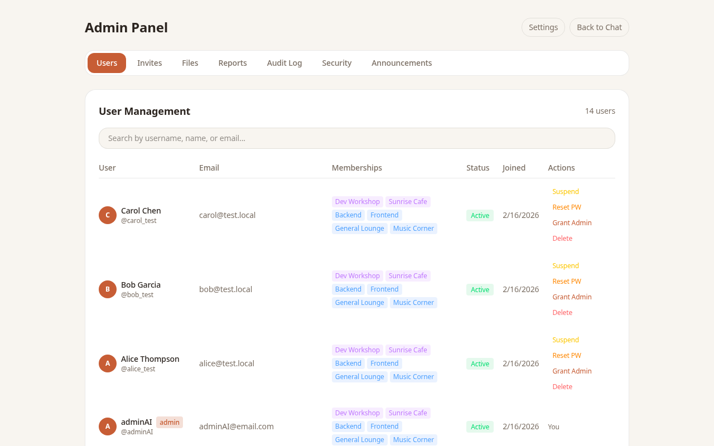
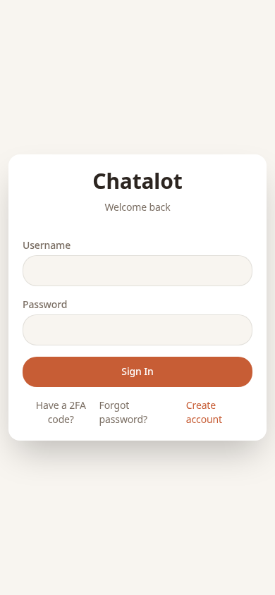
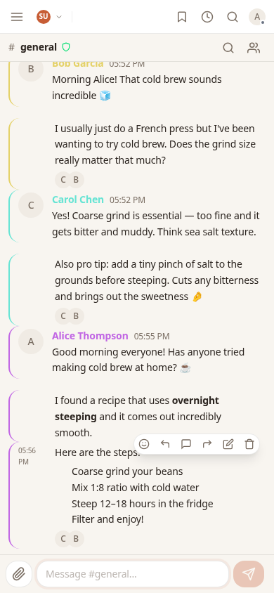

# Chatalot

**Your chat. Your server. Your rules.**

Chatalot is a self-hosted chat platform for friends, teams, and communities who refuse to hand their conversations to corporations. Real-time messaging, voice and video calls, end-to-end encryption, and a desktop app — all running on hardware you control.

No data harvesting. No algorithmic feeds. No subscription tiers to unlock basic features. Just a fast, modern chat experience that belongs entirely to you.

> **Our mission:** Chatalot was born from a simple belief — your conversations are yours. Not a corporation's asset, not a data point, not a product. This is an independent, passion-driven project built for the long haul, with no corporate ties, no investors, and no exit strategy. Just software that respects its users. [Read the full mission statement &rarr;](MISSION.md)

<p align="center">
  
</p>

<details>
<summary>Dark mode & customization</summary>

<p align="center">
  
  <br><br>
  
</p>

</details>

<details>
<summary>More screenshots</summary>

<p align="center">
  
  
  <br><br>
  
  <br><br>
  
  <br><br>
  
  <br><br>
  
  
</p>

</details>

## Why Chatalot?

Most chat platforms make you choose: convenience or privacy. Centralized services own your data and can change the rules whenever they want. Federated alternatives promise freedom but deliver complexity — running a node shouldn't require a systems engineering degree.

Chatalot takes a different approach: **one Docker command, and you're live.** A single binary serves the API, WebSocket connections, and the web UI. Add the desktop app for native performance. Invite your people with access codes. Done.

### What you get

- **Communities, groups, and channels** — organize your server with roles, permissions, and invite links
- **Personal groups** — moderators assign isolated spaces to members with full channel control; privacy and invite permissions managed by moderators
- **Voice and video calls** — peer-to-peer WebRTC with video grid (up to 25 participants)
- **End-to-end encryption** — Signal protocol (X3DH + Double Ratchet for DMs, Sender Keys for groups), compiled to WASM and running client-side, with per-message lock icons, fingerprint verification, and TOFU key change warnings
- **Rich messaging** — markdown, syntax-highlighted code blocks, inline media previews, GIF search, emoji autocomplete, reactions, replies, and forwarding
- **Polls** — create polls with 2-10 options, multi-select, anonymous voting, optional expiry, and real-time vote broadcasting
- **Custom emoji** — upload per-community emoji (PNG/GIF/WebP), use with `:shortcode:` syntax, autocomplete in composer
- **File sharing** — drag-and-drop, clipboard paste, inline image/video/audio previews with lightbox viewer
- **Desktop notifications** — configurable per-channel with sound controls
- **Web push notifications** — receive DM notifications even when the tab is closed (metadata only, never message content)
- **Customization** — themes, 8 accent colors, message density, sidebar layout (expanded panel or compact dropdown), font size, time format, profile banners, community theming with custom CSS, group icons/banners/accent colors, voice call backgrounds (6 presets + custom), and more
- **Webhooks** — create incoming webhooks for channels, post messages from external services
- **Desktop app** — native Linux and Windows clients via Tauri 2.0, with auto-update and OS keychain integration
- **Security** — Argon2id passwords, Ed25519-signed JWTs, TOTP 2FA with backup codes, rate limiting, invite-only registration, self-service account recovery
- **Moderation** — 5-tier role hierarchy (instance owner/admin, community owner/admin, moderator, member), message reports, user warnings, blocking, bans, timeouts, slow mode
- **Admin panel** — user management, invite codes, announcements, report review, webhooks overview, instance settings, and system feedback
- **Legal framework** — built-in privacy policy and terms of service, customizable per instance

For a complete feature list, see [Feature Status](docs/appendix/feature-status.md). For full documentation, see the [Chatalot Documentation](docs/README.md).

> All messages are end-to-end encrypted. DMs use the Signal protocol (X3DH + Double Ratchet), group channels use Sender Keys — both compiled to WASM and running in the browser. Keys are generated at registration, sessions are persisted in IndexedDB, and the server acts as an untrusted relay.

## Privacy by Design

Chatalot is built for people who take privacy seriously. Here's what that means in practice:

### Your admin cannot read your messages

All messages are end-to-end encrypted before leaving your device. The server stores only encrypted ciphertext — even someone with full database access sees nothing but random bytes.

### Your password is never stored

Passwords are hashed with Argon2id (64 MiB memory cost, 3 iterations, 4 parallel lanes). The original password cannot be recovered from the hash — not by admins, not by attackers, not by anyone.

### No telemetry, no analytics, no tracking

Chatalot collects zero telemetry. There are no analytics scripts, no usage tracking, no crash reporting, and no phone-home behavior. The software communicates only with its own database.

### Account recovery without email

Forgot your password? Use your recovery code — generated at registration, no email infrastructure needed. No admin intervention required. Your recovery code resets your password and generates a fresh code in one step.

### What the server can vs. cannot see

| The server can see | The server cannot see |
|---|---|
| Who sent a message and when | Message content (encrypted) |
| File metadata (size, type) | File contents (encrypted) |
| Your username and email | Your password (hashed) |
| When you're online | What you're typing |
| Channel membership | Private DM conversations |
| Login timestamps and IPs | 2FA secrets (encrypted at rest) |

## Quick Start

### Prerequisites

- Docker and Docker Compose v2
- OpenSSL (for generating keys on first run)
- **ARM64 supported** — runs natively on Raspberry Pi 4/5, Apple Silicon, and other ARM64 devices

### 1. Clone and generate secrets

```bash
git clone https://github.com/purpleneutral/chatalot.git
cd chatalot
./scripts/generate-secrets.sh
```

This creates JWT signing keys (`secrets/`) and a `.env` file with a random database password and encryption key.

### 2. Start everything

```bash
docker compose up -d
```

Two containers come up:
- **chatalot** — the Rust server + web UI on port 8080
- **postgres** — PostgreSQL 17 (internal only, not exposed to the host)

### 3. Open and register

Navigate to `http://localhost:8080`. Since registration defaults to **invite-only**, the first user must set `REGISTRATION_MODE=open` in `.env` (or use the deploy script which handles this). After creating the admin account, switch back to `invite_only` and generate invite codes from the admin panel.

To allow open registration:
```bash
# In .env, set:
REGISTRATION_MODE=open

# Then restart:
docker compose up -d
```

### Registration Modes

| Mode | Behavior |
|------|----------|
| `invite_only` (default) | Users need a valid invite code to register |
| `open` | Anyone can register |
| `closed` | Registration is completely disabled |

Admins generate invite codes from the admin panel. Codes can have usage limits and expiration dates.

### Pre-built Images (recommended for ARM/Raspberry Pi)

Building from source on ARM devices takes 20+ minutes (Rust compilation). Pre-built multi-arch images are available on GHCR:

```bash
# Use the pre-built image instead of building locally
# In docker-compose.override.yml:
services:
  chatalot:
    image: ghcr.io/purpleneutral/chatalot:latest
    build: !reset null
```

Then run `docker compose up -d` as normal. The correct architecture (amd64 or arm64) is selected automatically.

## Expose to the Internet

### Option A: Cloudflare Quick Tunnel (free, no domain needed)

```bash
docker compose --profile quick-tunnel up -d
```

This spins up a `cloudflared` container that creates a temporary public URL. Check the logs for your URL:

```bash
docker compose logs cloudflared-quick | grep trycloudflare
```

Share that URL with your friends — it works immediately, no DNS or certificates to configure.

### Option B: Cloudflare Named Tunnel (persistent domain)

```bash
# Add your tunnel token to .env
echo "CLOUDFLARE_TUNNEL_TOKEN=your_token" >> .env

# Start with the production profile
docker compose --profile production up -d
```

### Option C: Reverse Proxy (Traefik, nginx, Caddy, etc.)

The server listens on port 8080. Create a `docker-compose.override.yml` (gitignored):

```yaml
services:
  chatalot:
    labels:
      - "traefik.enable=true"
      - "traefik.http.routers.chatalot.rule=Host(`chat.example.com`)"
      - "traefik.http.routers.chatalot.entrypoints=websecure"
      - "traefik.http.routers.chatalot.tls=true"
      - "traefik.http.services.chatalot.loadbalancer.server.port=8080"
    networks:
      - proxy-network

networks:
  proxy-network:
    external: true
```

WebSocket connections at `/ws` are proxied automatically.

## Desktop App

Native desktop clients are built with Tauri 2.0. They connect to any Chatalot server — just enter the URL on first launch.

### Download

Check the [Releases](../../releases) page for:
- **Linux**: AppImage (run anywhere), `.deb`, `.rpm`
- **Windows**: NSIS installer (`.exe`)

### Build from source

```bash
# Install Tauri CLI
cargo install tauri-cli

# Install web dependencies
cd clients/web && npm install && cd ../..

# Build (this also builds the web frontend automatically)
cd clients/desktop/src-tauri && cargo tauri build
```

Requires Rust 1.84+, Node.js 22+, and platform-specific dependencies (WebKitGTK on Linux, WebView2 on Windows).

## Tech Stack

| Layer | Technology |
|-------|-----------|
| Server | Rust (axum + tokio) |
| Database | PostgreSQL 17 |
| Web Client | Svelte 5 + Tailwind CSS |
| Desktop Client | Tauri 2.0 |
| E2E Encryption | X3DH + Double Ratchet, ChaCha20-Poly1305 (Rust → WASM) |
| Auth | Argon2id passwords, Ed25519-signed JWTs, refresh token rotation |
| Voice/Video | WebRTC mesh (up to 25 participants) |
| Deployment | Docker Compose, Cloudflare Tunnel |

## Security

### Encryption

The server is designed as an **untrusted relay** — it stores and routes messages but is architecturally separated from plaintext content.

- **DMs**: X3DH key agreement + Double Ratchet — forward secrecy and break-in recovery, compiled to WASM and running client-side
- **Groups**: Sender Keys — each member distributes a symmetric chain key; key rotation on member removal
- **Cipher**: ChaCha20-Poly1305 (AEAD)
- **Key exchange**: X25519
- **Signatures**: Ed25519
- **Key storage**: IndexedDB (web), OS keychain (desktop, planned)
- **Session persistence**: Double Ratchet sessions and decrypted message cache stored in IndexedDB
- **Prekey management**: Automatic replenishment when one-time prekeys run low

### Authentication

- Passwords hashed with **Argon2id** (64 MiB memory, 3 iterations, 4 lanes)
- **JWT access tokens**: 15-minute expiry, Ed25519-signed
- **Refresh tokens**: 30-day expiry, stored as SHA-256 hash, rotated on each use
- **TOTP 2FA**: RFC 6238, optional per-user, with 8 single-use backup codes
- **Recovery codes**: self-service password reset without email, generated at registration
- **Account lockout**: 10 failed attempts triggers 15-minute lockout

### Server Hardening

- Rate limiting: token-bucket per IP (20 req/s general, 5 req/s auth)
- Security headers: HSTS, CSP, X-Frame-Options, Permissions-Policy
- SSRF protection on link previews (blocks private/internal IPs)
- Channel authorization on all message, file, and typing operations
- Audit logging of all auth events with IP and user agent

## Project Structure

```
chatalot/
├── crates/
│   ├── chatalot-server/       # axum HTTP/WS server
│   │   └── src/
│   │       ├── routes/        # REST API endpoints
│   │       ├── ws/            # WebSocket handler + connection manager
│   │       ├── middleware/     # JWT auth, rate limiting, security headers
│   │       └── services/      # Auth service, business logic
│   ├── chatalot-db/           # Database layer (repository pattern)
│   │   └── src/
│   │       ├── models/        # Rust structs matching DB tables
│   │       └── repos/         # Query functions per entity
│   ├── chatalot-crypto/       # E2E encryption library
│   │   └── src/
│   │       ├── x3dh.rs        # X3DH key agreement
│   │       ├── double_ratchet.rs
│   │       ├── sender_keys.rs
│   │       └── aead.rs        # ChaCha20-Poly1305
│   ├── chatalot-crypto-wasm/  # WASM bindings for browser crypto
│   └── chatalot-common/       # Shared types (API DTOs, WS messages)
├── clients/
│   ├── web/                   # Svelte 5 SPA
│   │   └── src/
│   │       ├── lib/api/       # REST client
│   │       ├── lib/crypto/    # E2E crypto (WASM loader, IndexedDB, session manager)
│   │       ├── lib/ws/        # WebSocket client
│   │       ├── lib/stores/    # Svelte 5 rune-based state (17 stores)
│   │       ├── lib/components/# Reusable UI components
│   │       ├── lib/utils/     # Emoji data, helpers
│   │       ├── lib/webrtc/    # WebRTC call manager
│   │       └── routes/        # Pages
│   └── desktop/               # Tauri 2.0 wrapper
├── docs/                      # Detailed documentation
├── migrations/                # PostgreSQL migrations (48 files)
├── scripts/
│   ├── install.sh             # Interactive setup wizard
│   ├── deploy.sh              # Automated deploy (commit, push, pull, rebuild)
│   ├── generate-secrets.sh    # Generate JWT keys + .env
│   ├── generate-keys.sh       # Generate JWT keys only
│   └── build-wasm.sh          # Build WASM crypto module for web client
├── .github/workflows/         # CI: multi-arch Docker image builds (amd64 + arm64)
├── Dockerfile                 # Multi-stage build
└── docker-compose.yml
```

## Environment Variables

| Variable | Default | Description |
|----------|---------|-------------|
| `DATABASE_URL` | *required* | PostgreSQL connection string |
| `JWT_PRIVATE_KEY_PATH` | `./secrets/jwt_private.pem` | Ed25519 private key |
| `JWT_PUBLIC_KEY_PATH` | `./secrets/jwt_public.pem` | Ed25519 public key |
| `TOTP_ENCRYPTION_KEY` | *optional* | Hex key for encrypting TOTP secrets at rest |
| `REGISTRATION_MODE` | `invite_only` | `open`, `invite_only`, or `closed` |
| `ADMIN_USERNAME` | *optional* | Username that gets admin privileges |
| `LISTEN_ADDR` | `0.0.0.0:8080` | Server bind address |
| `FILE_STORAGE_PATH` | `./data/files` | Encrypted file storage directory |
| `MAX_FILE_SIZE_MB` | `100` | Max upload size in MB (1–10,000) |
| `UPLOAD_QUOTA_MB` | `500` | Per-user upload quota in MB (0 = unlimited) |
| `COMMUNITY_CREATION_MODE` | `admin_only` | `open` or `admin_only` |
| `ICE_SERVERS` | *optional* | JSON array of STUN/TURN servers for WebRTC |
| `RUST_LOG` | `info` | Log level |
| `VAPID_PRIVATE_KEY` | *optional* | Base64-encoded ECDSA P-256 private key for web push notifications |
| `VAPID_PUBLIC_KEY` | *optional* | Base64-encoded ECDSA P-256 public key for web push notifications |
| `CLOUDFLARE_TUNNEL_TOKEN` | *optional* | For production Cloudflare Tunnel profile |
| `GIPHY_API_KEY` | *optional* | Giphy API key for GIF search ([get one free](https://developers.giphy.com/dashboard/)) |

## Development

### Prerequisites

- Rust 1.84+ (edition 2024)
- Node.js 22+
- PostgreSQL 17 (or use Docker)
- [wasm-pack](https://rustwasm.github.io/wasm-pack/) (for building the crypto WASM module)

### Running locally

```bash
# Database
docker compose up postgres -d

# Server
cp .env.example .env
./scripts/generate-secrets.sh
cargo run

# Build WASM crypto module (required before web client)
./scripts/build-wasm.sh

# Web client (separate terminal)
cd clients/web
npm install
npm run dev
```

### Tests

```bash
cargo test          # 59 unit tests (crypto, auth, security, CSS sanitizer)
cargo clippy        # Lint checks
cd clients/web && npm run check   # Svelte type checking
```

> **Note**: The Docker build handles the WASM compilation automatically — `build-wasm.sh` is only needed for local development.

## Deployment

### Automated

```bash
# Full deploy: commit, push, pull on server, rebuild containers
./scripts/deploy.sh "your commit message"

# Just pull and restart on server
./scripts/deploy.sh --pull-only
```

Configure with environment variables: `DEPLOY_HOST`, `DEPLOY_DIR`, `DEPLOY_GIT_URL`. See `scripts/deploy.sh` for all options.

### Manual

```bash
git clone <repo-url> chatalot && cd chatalot
./scripts/generate-secrets.sh
docker compose up -d --build
```

## For Hosts

Running a Chatalot instance means you're responsible for the people who use it. Here's what that looks like:

- **You control registration** — use invite-only mode (default) to decide who joins. Generate codes from the admin panel with usage limits and expiration.
- **You moderate content** — use the reports queue, user warnings, bans, timeouts, and slow mode. You can suspend accounts and purge content.
- **You handle data** — back up your PostgreSQL database and `data/` directory regularly. Messages are encrypted, but metadata (users, channels, memberships) is not.
- **You're the authority** — the built-in Terms of Service and Privacy Policy are customizable defaults. Drop your own `data/terms-of-service.md` and `data/privacy-policy.md` to override them.
- **You're not the developer** — the Chatalot developers built the software but don't operate your instance. You're responsible for security, uptime, and compliance in your jurisdiction.

## For Users

Joining a Chatalot instance means trusting the person who runs it. Here's what you should know:

- **Verify your host** — E2E encryption protects message content, but the server admin controls the infrastructure. Only join instances run by people you trust.
- **Save your recovery code** — it's shown once at registration. It's the only way to reset your password without admin help. You can regenerate it from Settings > Security.
- **Enable 2FA** — TOTP-based two-factor authentication adds a second layer of protection. Save your 8 backup codes in case you lose your authenticator.
- **E2E encryption protects content, not metadata** — the server can see who you message and when, but not what you say. Channel names, usernames, and membership are visible to admins.
- **Your data stays on this instance** — there's no federation, no cloud sync, and no third-party analytics. When you delete your account, your data is removed.

## Support

If Chatalot is useful to you, consider buying me a coffee:

[](https://buymeacoffee.com/uniqueuserg)

## License

GPL-3.0 — see [LICENSE](LICENSE) for details.
