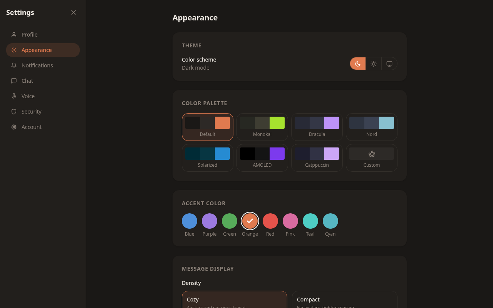
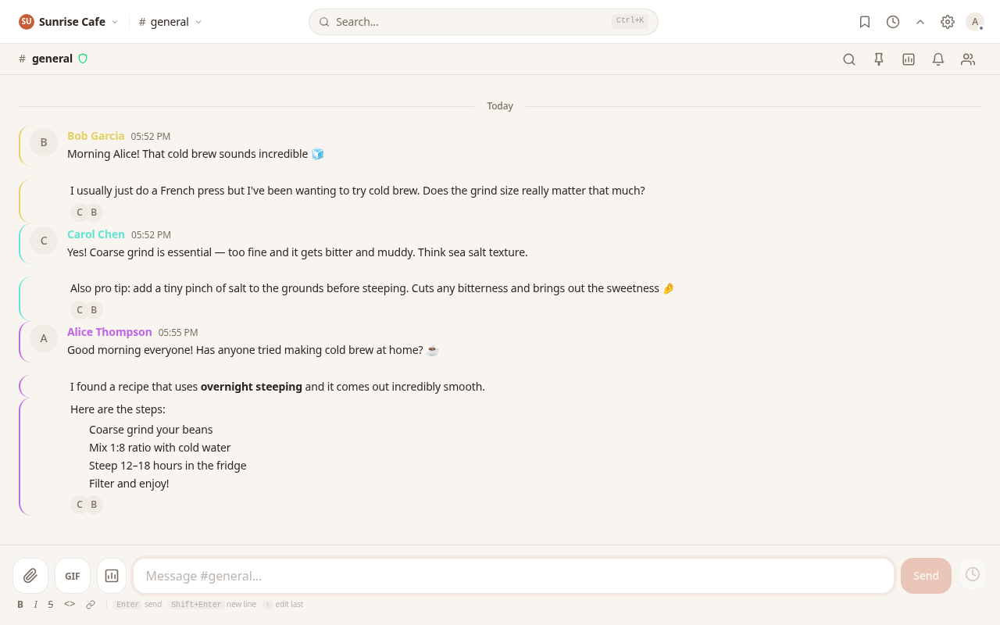

# Themes

> **Status: Complete**

Chatalot supports three theme modes that control whether the interface uses dark or light colors.

## Available Modes

| Mode | Behavior |
|------|----------|
| **Dark** | Always uses the dark color scheme |
| **Light** | Always uses the light color scheme |
| **System** | Follows your operating system preference and switches automatically |

## How to Switch Themes

1. Open **Settings** (gear icon in the sidebar).
2. Go to the **Appearance** tab.
3. In the **Theme** section, click one of the three buttons: the moon icon for Dark, the sun icon for Light, or the monitor icon for System.

The change takes effect immediately. When set to System, Chatalot listens for OS-level preference changes and switches in real time -- for example, if your OS switches to dark mode at sunset, Chatalot will follow automatically.

## Screenshots

### Light Mode

### Dark Mode

### Chat in Dark Mode

### Chat in Light Mode

## How It Works

The theme is applied by setting a `data-theme` attribute on the root HTML element (`dark` or `light`). All UI colors are defined as CSS custom properties that respond to this attribute:

- Dark mode uses warm, low-contrast backgrounds (`#1a1816`, `#221f1c`) with light text (`#ede8e2`).
- Light mode uses bright, paper-toned backgrounds (`#f8f5f0`, `#ffffff`) with dark text (`#2c2520`).

Your theme choice is saved to local storage (`chatalot-theme`) and persists across sessions.

> **Tip:** If you use a color palette other than Default, both dark and light variants of that palette are available. Switching between dark and light mode will use the palette's corresponding color set.

## Related

- [Color Palettes](./color-palettes.md) -- change the entire color scheme beyond just dark/light
- [Accent Colors](./accent-colors.md) -- customize the highlight color used for buttons and links
